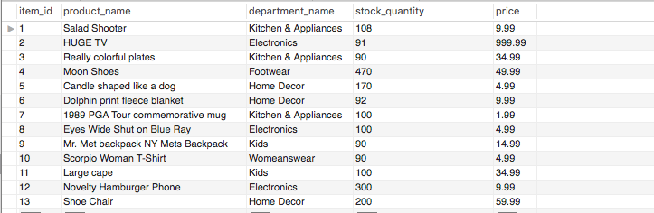

# Bamazon
Bamazon is a MySQL Amazon-like storefront with two different views

## Customer View

Customer view querries the Bamazon database and selects the item ID, product name and price from the products table and displays them using the formatting provided by the console.table npm package. 

Customer view then takes the results of the object array from mySQL and prompts users to enter:

**The ID of the product they would like to purchase** and **How many units of the product they would like to buy**

After the information is entered into the inquirer promts, the user is shown **whether or not there is sufficient stock in the warehouse to make the transaction** and the **total amount of their purchase:** 

If there is insufficent quantity to fill the order the Customer view will log "Insufficient Quantity" and the transaction will not go through. 

In the following example, there are 170 candles shaped like a dog in the warehouse. 

If the user tries to purchase more than 190 the "Insufficent Quantity" message displays and the available items table and selection prompts are rerun: 

## Manager View

In manager view the user user can manipulate information the MySQL database using the follwing options. 

### View Products for Sale

View products for sale allows users to see the list of products available for sale. 

### View Low Inventory

View low inventory allowes users to see a list of items with less than 100 units available in inventory.

### Add to Inventory

Add to inventory enables users to add an item to the database. In the following example you'll see that there are less than 100 units of Salad Shooters in the products table. 

After the new quantity is pushed to the databse,  Salad Shooter no longer displays with the low inventory items

And the new quantity is reflected in MySql.

### Add New Product

Users can add a new product to the MySQL database using the "Add New Product" option. 

A series of inquirer prompts asks them to populate the "Product Name", "Department", "Quantity" and "Price" fields.  

In the previous example the user enters a new item called "Sad Clown Painting" was added to the inventory, and that is reflected in the database. 

## Node Packages Used 

* [Chalk](https://www.npmjs.com/package/chalk)
* [Inquirer](https://www.npmjs.com/package/inquirer)
* [Easy Table](https://www.npmjs.com/package/easy-table)
* [Console.Table](https://www.npmjs.com/package/console.table)

